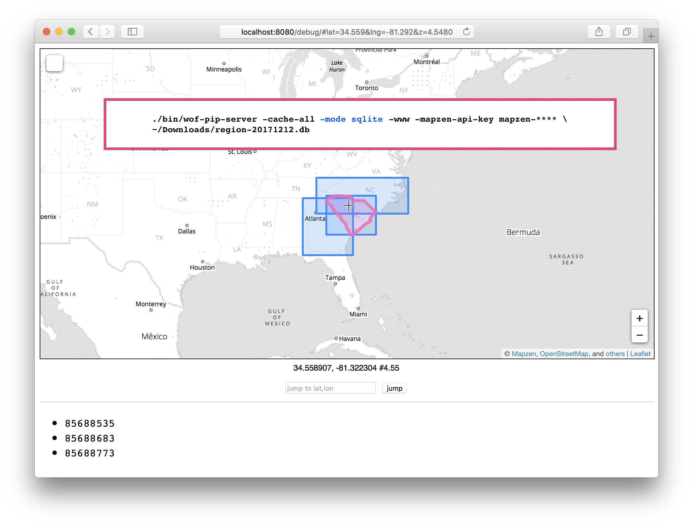
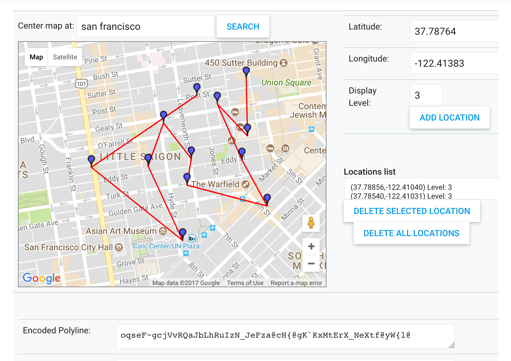
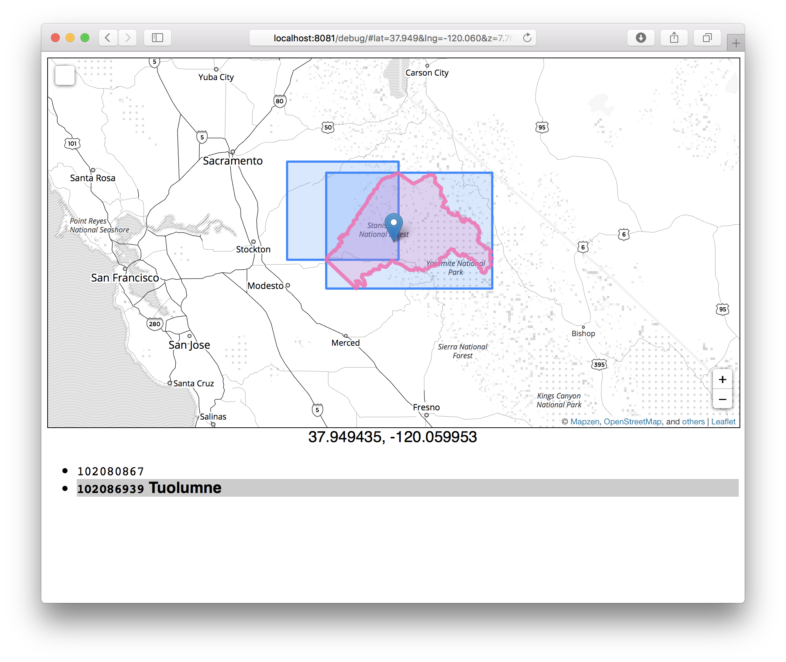
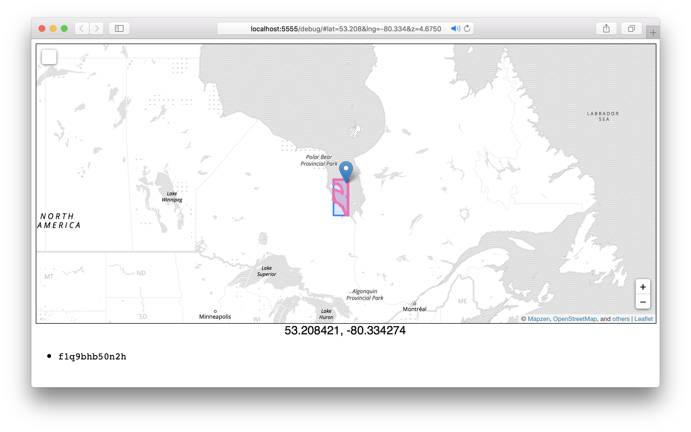

# go-whosonfirst-pip-v2

An in-memory point-in-polygon (reverse geocoding) package for GeoJSON data, principally Who's On First data.

_This package supersedes the [go-whosonfirst-pip](https://github.com/whosonfirst/go-whosonfirst-pip) package which is no longer maintained._

## Install

You will need to have both `Go` (specifically a version of Go more recent than 1.7 so let's just assume you need [Go 1.9](https://golang.org/dl/) or higher) and the `make` programs installed on your computer. Assuming you do just type:

```
make bin
```

All of this package's dependencies are bundled with the code in the `vendor` directory.

## Important

The documentation in this package is incomplete where "incomplete" really means something like "we took the entire motorcyle apart and it's still spread out on the floor of the garage waiting to be reassembled". This is not a feature. It's an unfortunate by-product of the usual bad craziness around here.

Proper documentation is quickly making itself a priority but in the interim if you want to understand what's going on, in broad strokes, I'd suggest looking at [https://github.com/whosonfirst/go-whosonfirst-pip](https://github.com/whosonfirst/go-whosonfirst-pip). Pretty much everything under the hood has changed as have the public interfaces but _in broad stokes_ both packages have the same goal and do the same thing.

## Example

To run as a pip-server, specify "-mode directory" and give the data directory as the first (non optional) argument.
```
./bin/wof-pip-server -mode directory -port 8080 /usr/local/data/whosonfirst-data/data
12:25:55.267986 [wof-pip-server] STATUS listening on localhost:8080
12:25:56.272296 [wof-pip-server] STATUS indexing 3023 records indexed
12:25:57.271904 [wof-pip-server] STATUS indexing 6554 records indexed
12:25:58.273400 [wof-pip-server] STATUS indexing 10200 records indexed
12:25:59.276565 [wof-pip-server] STATUS indexing 13596 records indexed
...
12:34:37.980572 [wof-pip-server] STATUS finished indexing
```

_Please write me._

## Responses

This is still in flux but the short version is the everything will be a [standard places result](https://github.com/whosonfirst/go-whosonfirst-spr). Once what that means _exactly_ has been nailed down (it's close).

## Interfaces

_Please write me._

### cache.Cache

```
type Cache interface {
	Get(string) (CacheItem, error)
	Set(string, CacheItem) error
	Hits() int64
	Misses() int64
	Evictions() int64
	Size() int64
}
```

### cache.CacheItem

```
type CacheItem interface {
	SPR() spr.StandardPlacesResult
	Polygons() []geojson.Polygon
	Geometry() pip.GeoJSONGeometry
}
```

### cache.FeatureCache

```
type FeatureCache struct {
	CacheItem       `json:",omitempty"`
	FeatureSPR      spr.StandardPlacesResult `json:"spr"`
	FeaturePolygons []geojson.Polygon        `json:"polygons"`
}
```

### index.Index

```
type Index interface {
	IndexFeature(geojson.Feature) error
	Cache() cache.Cache
	GetIntersectsByCoord(geom.Coord, filter.Filter) (spr.StandardPlacesResults, error)
	GetCandidatesByCoord(geom.Coord) (*pip.GeoJSONFeatureCollection, error)
	GetIntersectsByPath(geom.Path, filter.Filter) ([]spr.StandardPlacesResults, error)
}
```

## Tools

_Please write me._

### wof-pip-server

_Please write me._

For example, to index [Who's On First data published as a SQLite database](https://whosonfirst.mapzen.com/sqlite) and spinning up a little web server for debugging things you might do something like:

```
wget https://whosonfirst.mapzen.com/sqlite/region-20171212.db.bz2
bunzip2 region-20171212.db.bz2
```

And then:

```
./bin/wof-pip-server -cache-all -mode sqlite -www -mapzen-api-key mapzen-**** region-20171212.db
16:37:25.490337 [wof-pip-server] STATUS -www flag is true causing the following flags to also be true: -allow-geojson -candidates
16:37:25.490562 [wof-pip-server] STATUS listening on localhost:8080
16:37:26.491416 [wof-pip-server] STATUS indexing 33 records indexed
16:37:27.495491 [wof-pip-server] STATUS indexing 118 records indexed
16:37:28.490831 [wof-pip-server] STATUS indexing 138 records indexed
16:37:29.490722 [wof-pip-server] STATUS indexing 312 records indexed
...time passes...
16:40:25.496078 [wof-pip-server] STATUS indexing 4691 records indexed
16:40:26.498284 [wof-pip-server] STATUS indexing 4694 records indexed
16:40:27.494674 [wof-pip-server] STATUS indexing 4697 records indexed
16:40:28.494235 [wof-pip-server] STATUS indexing 4900 records indexed
16:40:29.498331 [wof-pip-server] STATUS indexing 4952 records indexed
16:40:29.562617 [wof-pip-server] STATUS finished indexing
```

_Note the part where you need to get a [Mapzen API key](https://mapzen.com/developers/) in order for the map-y parts of things to work._

And finally:

```
open localhost:8080/debug
```

And you should see something like this:



#### Fancy

Indexing results and then fetching all the places that intersect a polyline:

```
./bin/wof-pip-server -polylines -mode meta /usr/local/data/whosonfirst-data/meta/wof-microhood-latest.csv
11:56:04.605805 [wof-pip-server] STATUS listening on localhost:8080
11:56:05.606812 [wof-pip-server] STATUS indexing 537 records indexed
11:56:06.608378 [wof-pip-server] STATUS indexing 749 records indexed
11:56:07.610900 [wof-pip-server] STATUS indexing 1069 records indexed
11:56:08.609043 [wof-pip-server] STATUS indexing 1298 records indexed
11:56:09.356357 [wof-pip-server][index] STATUS time to index meta file '/usr/local/data/whosonfirst-data/meta/wof-microhood-latest.csv' 4.750478843s
11:56:09.356370 [wof-pip-server][index] STATUS time to index path '/usr/local/data/whosonfirst-data/meta/wof-microhood-latest.csv' 4.750568978s
11:56:09.356374 [wof-pip-server][index] STATUS time to index paths (1) 4.750577455s
11:56:09.356377 [wof-pip-server] STATUS finished indexing
```

And then given a polyline (`oqseF~gcjVvRQaJbLhRuIzN_JeFza@cH{@gK`KxMtErX_NeXtf@yW{l@`) like this:



You could do this:

```
curl -s 'localhost:8080/polyline?polyline=oqseF%7EgcjVvRQaJbLhRuIzN_JeFza%40cH%7B%40gK%60KxMtErX_NeXtf%40yW%7Bl%40' | jq '.places[]["wof:name"]'
"The Sit/Lie"
"The Park"
"The Gimlet"
"The Panhandle"
"Financial District South"
"The Post Up"
"Little Saigon"
"Little Saigon"
"The Panhandle"
"Deli Hills"
"The Panhandle"
"Civic Center"
"Van Ness"
```

There are two important things to note here, at least as of this writing:

1. It is left as an exercise to consumers of the `/polyline` endpoint to deduplicate results (assuming you wanted a list of unique places that intersect a polyline)
2. If you are passing in [a polyline line returned from Mapzen's Turn-By-Turn service](https://mapzen.com/documentation/mobility/decoding/) you will need to include a `?precision=6` query parameter with your request so that the code can properly decode your polyline
2. The response format for the `/polyline` endpoint _will_ change so please don't get too attached to anything that is returned today

See also: https://github.com/whosonfirst/go-mapzen-valhalla#valhalla-route

#### Fancy McFancyPants

Indexing API results (in this case counties in California) by piping them in to `wof-pip-server` on STDIN:

```
../go-whosonfirst-api/bin/wof-api -param api_key=mapzen-xxxxxx \
    -param method=whosonfirst.places.getDescendants -param id=85688637 \
    -param placetype=county -geojson-ls \
    | \
    ./bin/wof-pip-server -mode geojson-ls -www -mapzen-api-key mapzen-xxxxxx \
    -cache gocache -port 8081 \
    STDIN
    
11:18:19.537724 [wof-pip-server] STATUS listening on localhost:8081
11:18:20.538209 [wof-pip-server] STATUS indexing 0 records indexed
11:18:21.538002 [wof-pip-server] STATUS indexing 2 records indexed
11:18:22.538104 [wof-pip-server] STATUS indexing 4 records indexed
...
11:18:45.537952 [wof-pip-server] STATUS indexing 51 records indexed
11:18:46.538419 [wof-pip-server] STATUS indexing 54 records indexed
11:18:47.539162 [wof-pip-server] STATUS indexing 57 records indexed
11:18:47.736253 [wof-pip-server][index] STATUS time to index geojson-ls 'STDIN' 28.198454417s
11:18:47.736274 [wof-pip-server][index] STATUS time to index path 'STDIN' 28.198542171s
11:18:47.736282 [wof-pip-server][index] STATUS time to index paths (1) 28.198563784s
11:18:47.736288 [wof-pip-server] STATUS finished indexing
```



#### Plain old GeoJSON

Let assume that you've downloaded the [OSM water polygons data](http://openstreetmapdata.com/data/water-polygons) and created a GeoJSON file. For example:

```
cd /usr/local
wget http://data.openstreetmapdata.com/water-polygons-split-4326.zip
unzip water-polygons-split-4326.zip
cd water-polygons-split-4326
ogr2ogr -F GeoJSON water_polygons.geojson water_polygons.shp
```

Now we start up the PIP server passing along the `-plain-old-geojson` and `-mode feature-collection` flag:

```
./bin/wof-pip-server -port 5555 -cache-all -allow-geojson -www -mapzen-api-key mapzen-xxxxxxx \
	-plain-old-geojson -mode feature-collection /usr/local/water-polygons-split-4326/water_polygons.geojson

10:33:49.735255 [wof-pip-server] STATUS -www flag is true causing the following flags to also be true: -allow-geojson -candidates
10:33:49.735402 [wof-pip-server] STATUS listening on localhost:5555
10:33:50.735473 [wof-pip-server] STATUS indexing 0 records indexed
10:33:51.736308 [wof-pip-server] STATUS indexing 0 records indexed
10:33:52.735489 [wof-pip-server] STATUS indexing 0 records indexed
...
10:47:52.756351 [wof-pip-server] STATUS indexing 41239 records indexed
10:47:53.755285 [wof-pip-server] STATUS indexing 41311 records indexed
10:47:54.754969 [wof-pip-server] STATUS indexing 41376 records indexed
10:47:55.757847 [wof-pip-server] STATUS indexing 41405 records indexed
10:47:56.479703 [wof-pip-server][index] STATUS time to index feature collection '/usr/local/water-polygons-split-4326/water_polygons.geojson' 14m6.724468767s
10:47:56.479721 [wof-pip-server][index] STATUS time to index path '/usr/local/water-polygons-split-4326/water_polygons.geojson' 14m6.725233324s
10:47:56.479725 [wof-pip-server][index] STATUS time to index paths (1) 14m6.725246195s
10:47:56.479729 [wof-pip-server] STATUS finished indexing
```

And then you would query it as usual:

```
curl 'http://localhost:5555/?latitude=54.793624&longitude=-79.948933&format=geojson' \
{"type":"FeatureCollection","features":[{"type":"Feature","geometry":{"type":"MultiPolygon","coordinates":[[[[-80.15635,54.140525],[-80.15635,54.84385],[-79.8045875,54.84385],[-79.8045875,54.72711395185386],[-79.8061901,54.7266501],[-79.8070701,54.7267899],[-79.8075399,54.7257701],[-79.8102099,54.72528],[-79.81023,54.7247701],[-79.8111099,54.7249099],[-79.8119999,54.72453],[-79.81206,54.72274],[-79.8045875,54.724551416699605],[-79.8045875,54.140525],[-80.15635,54.140525]],[],[],[[-79.93955,54.4322999],[-79.93886,54.4331899],[-79.9390599,54.43422],[-79.943,54.4345099],[-79.94302,54.4337399],[-79.94258,54.4337299],[-79.9417399,54.43257],[-79.93955,54.4322999]],[[-79.83404,54.7429299],[-79.82869,54.74429],[-79.8282299,54.7449199],[-79.82735,54.7449199],[-79.8273199,54.74594],[-79.8268701,54.74594],[-79.82729,54.74696],[-79.82818,54.74672],[-79.8281901,54.7462],[-79.8299701,54.74597],[-79.8304399,54.7452],[-79.8317699,54.74521],[-79.8326799,54.7442],[-79.8344499,54.7442201],[-79.8341901,54.74328],[-79.83449,54.74295],[-79.83404,54.7429299]]]]},"properties":{"spr:id":"f1xnh0000000","spr:name":"f1xnh0000000","spr:placetype":"polygon","spr:latitude":54.4921875,"spr:longitude":-79.98046875,"spr:min_latitude":54.140525,"spr:min_longitude":-80.15635,"spr:max_latitude":54.84385,"spr:max_longitude":-79.8045875}}],"pagination":{"total_count":0,"page":0,"per_page":0,"page_count":0}}
```



## Docker

[Yes](Dockerfile), although it's still early days and not terribly sophisticated yet (for example it only works with [SQLite](https://whosonfirst.mapzen.com/sqlite) databases right now).

```
docker build -t wof-pip-server .

docker run -p 6161:8080 -e HOST='0.0.0.0' -e EXTRAS='allow' -e MODE='sqlite' -e SOURCES='timezone-20171212' wof-pip-server
fetch https://whosonfirst.mapzen.com/sqlite/timezone-20171212.db
/go-whosonfirst-pip-v2/bin/wof-pip-server -host 0.0.0.0 -allow-extras -mode sqlite /usr/local/data/timezone-20171212.db
00:08:41.764637 [wof-pip-server] STATUS create temporary extras database '/tmp/pip-extras738521352'
00:08:41.766112 [wof-pip-server] STATUS listening on 0.0.0.0:8080
00:08:42.777847 [wof-pip-server] STATUS indexing 11 records indexed
00:08:43.777756 [wof-pip-server] STATUS indexing 24 records indexed
... time passes ...
00:08:58.777526 [wof-pip-server] STATUS indexing 331 records indexed
00:08:59.777888 [wof-pip-server] STATUS indexing 355 records indexed
00:09:00.310773 [wof-pip-server] STATUS finished indexing

curl -s 'http://localhost:6161/?latitude=37.794906&longitude=-122.395229' | python -mjson.tool
{
    "places": [
        {
            "mz:is_ceased": -1,
            "mz:is_current": -1,
            "mz:is_deprecated": 0,
            "mz:is_superseded": 0,
            "mz:is_superseding": 0,
            "mz:latitude": 38.27008,
            "mz:longitude": -118.219968,
            "mz:max_latitude": 49.002892,
            "mz:max_longitude": -114.039345,
            "mz:min_latitude": 32.534622,
            "mz:min_longitude": -124.733253,
            "mz:uri": "https://whosonfirst.mapzen.com/data/102/047/421/102047421.geojson",
            "wof:country": "",
            "wof:id": 102047421,
            "wof:lastmodified": 1466627377,
            "wof:name": "America/Los_Angeles",
            "wof:parent_id": 85633793,
            "wof:path": "102/047/421/102047421.geojson",
            "wof:placetype": "timezone",
            "wof:repo": "whosonfirst-data",
            "wof:superseded_by": [],
            "wof:supersedes": []
        }
    ]
}
```

## Performance

Proper performance and load-testing figures still need to be compiled but this is what happened when I ran `siege` with 200 concurrent clients reading from the [testdata/urls.txt](testdata) file and then forgot about it for a week:

```
$> siege -v -c 200 -i -f testdata/urls.txt
...time passes...
Transactions:              267175219 hits
Availability:                 100.00 %
Elapsed time:              686483.75 secs
Data transferred:         1200409.12 MB
Response time:                  0.01 secs
Transaction rate:             389.19 trans/sec
Throughput:                     1.75 MB/sec
Concurrency:                    5.32
Successful transactions:   267175219
Failed transactions:               0
Longest transaction:            0.97
Shortest transaction:           0.00
```

## See also

* https://github.com/whosonfirst/go-whosonfirst-geojson-v2
* https://github.com/whosonfirst/go-whosonfirst-pip
* https://github.com/whosonfirst/go-whosonfirst-spr
