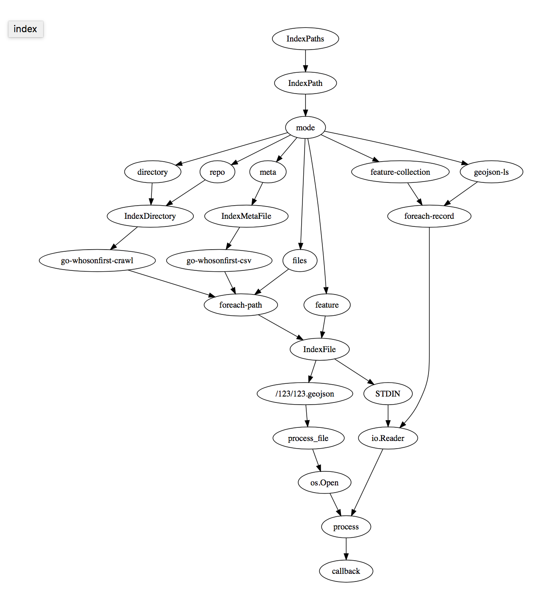

_This diagram is incomplete and not entirely accurate. I mean it's mostly accurate... until its not. We'll get there, but I just don't have time to yak-shave my way through the GraphVix/dot syntax right now._
